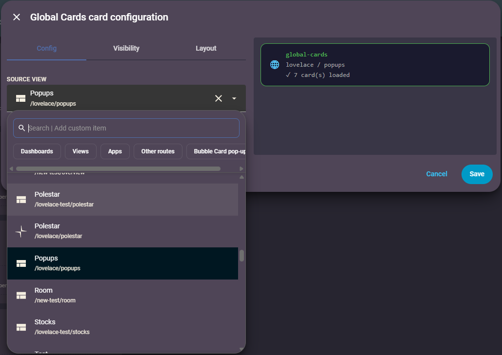

# Global Cards

A custom [Home Assistant](https://www.home-assistant.io) Lovelace card that lets you define cards once on a central dashboard and reuse them across multiple dashboards — without duplicating YAML.

## What it does

- **Popup mode** *(default)*: Injects cards (e.g. Bubble Card pop-ups) invisibly into the current dashboard. Pop-ups become accessible via their hash (e.g. `#my-popup`) from anywhere on the page.
- **Inline mode**: Renders cards visually in place — useful for global headers or shared UI sections.

-----

## Installation

### HACS (recommended)

1. Open HACS in Home Assistant
1. On the top right side, click the three dot and click Custom repositories
1. Where asked for a URL, paste the link of this repository: [https://github.com/dj3030/Global-cards](https://github.com/dj3030/Global-cards)
1. Where asked for a type, select Dashboard
1. Click the download button. ⬇️

### Manual

1. Download `global-cards.js` from the [latest release](../../releases/latest)
1. Copy it to `/config/www/global-cards.js`
1. Add it as a resource in Home Assistant:
- **Settings → Dashboards → Resources → Add resource**
- URL: `/local/global-cards.js`
- Type: `JavaScript module`
1. Hard refresh your browser (`Ctrl+Shift+R` / `Cmd+Shift+R`)

-----

## Setup

### 1. Choose a source

You need a dashboard (or a view within a dashboard) that contains the cards you want to share.

**Option A — Use a view on an existing dashboard** *(recommended)*  
Add a dedicated view (e.g. "Popups") to any dashboard you already have, and put your shared cards there.

**Option B — Create a dedicated dashboard**  
Create a new dashboard (e.g. named `Global Cards`) to hold all your shared cards.

---

### 2. Add the card and pick your source

Add a new `custom:global-cards` card to any dashboard. The built-in UI editor lets you search for and select your source view directly from a dropdown — all your dashboards and views are listed with their paths, so there is no need to look anything up manually.



> **Configuring via YAML?** Set `source_dashboard` to the url_path of the dashboard — the segment after `/lovelace/` in the browser address bar (e.g. `overview`). The dashboard edit dialog in Settings only shows Title and Icon; use the address bar instead.

```yaml
type: custom:global-cards
source_dashboard: overview   # url_path of the source dashboard
source_view: popups          # optional: a specific view path or title
```

-----

## Configuration

|Option            |Required|Default  |Description                                   |
|------------------|--------|---------|----------------------------------------------|
|`source_dashboard`|✅       |–        |`url_path` of the dashboard to load cards from|
|`source_view`     |❌       |all views|Path or title of a specific view to load from |
|`mode`            |❌       |`popup`  |`popup` (invisible) or `inline` (visible)     |

-----

## Examples

### Global Bubble Card pop-ups

Define your Bubble Card pop-ups once in a dedicated view (e.g. a "Popups" view on your "Overview" dashboard):

```yaml
# In your "Popups" view
type: custom:bubble-card
card_type: pop-up
hash: "#lights"
name: Lights
```

Then on any other dashboard:

```yaml
type: custom:global-cards
source_dashboard: overview
source_view: popups
```

Call the pop-up from a button:

```yaml
type: custom:bubble-card
card_type: button
button_type: name
button_action:
  tap_action:
    action: navigate
    navigation_path: "#lights"
```

-----

### Global header (inline mode)

Define a header view once with your preferred sections layout, then embed it on every dashboard:

```yaml
type: custom:global-cards
source_dashboard: overview
source_view: header
mode: inline
```

-----

## Edit mode

In edit mode, the card shows a status indicator with the source dashboard, view, and number of loaded cards. Outside edit mode it is completely invisible and takes no space in the layout.

-----

## Tips

> **After editing a source view, refresh your browser.** Global Cards caches the source dashboard config for 60 seconds. If you add, remove, or change cards in your source view, a browser refresh is needed to pick up the changes on other dashboards.

-----

## Releases

| Version | Changes |
|---------|---------|
| **V1.2.0** | Fixed inline mode for sections-type and grid-layout views (`hui-section` CSS variable handling); restructured project to `src/dist` layout |
| **V1.1.0** | Added UI editor |
| **V1.0.0** | Initial release |

-----

## Sponsor this project

<a href="https://buymeacoffee.com/andreasdj3030" target="_blank"></a> 

-----